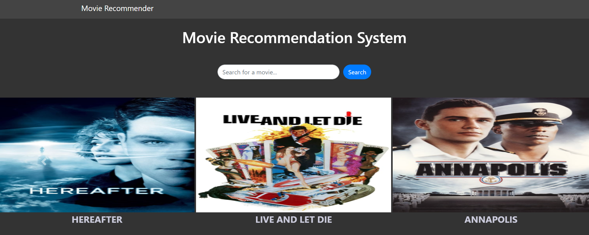

# Movie Recommendation System

Movie Recommendation System offers users personalized movie suggestions. Upon loading, the home page presents six randomly chosen movie titles. Additionally, the application includes a recommendation page that presents five movie recommendations in response to a user's search query.

## Requirements

- docker
- docker-compose

## Getting Started
To clone this repository, run the following in a terminal.

```bash
git clone https://github.com/SarthKale/Movie-Recommendation-System.git
cd Movie-Recommendation-System
```

## Features

- **Random Movie Display**: The home page randomly displays six movie titles every time it is visited.
- **Search and Recommend**: Users can search for a movie using the search bar. The system then displays five related movie recommendations on the recommendations page.

## Run Application
You can run this application in 2 ways - 1. Locally, 2. Inside Docker.

### Run Locally

Make sure you have python3.10 or higher installed on your system.
```bash
pip install --no-cache-dir -r requirements.txt
python main.py
```

### Run Inside a Docker Container

```bash
docker-compose -f docker-compose.yml build
docker-compose -f docker-compose.yml up
```

Open your browser, go to `localhost` to access the app.



## Technologies Used

- **Python**: Backend programming language.
- **Flask**: Python web framework.
- **HTML/CSS/JavaScript**: Used for creating the frontend.
- **Bootstrap**: For responsive design.

## Author
Sarthak Kale
